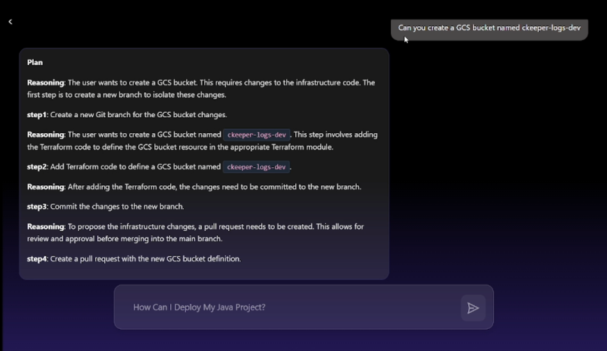

# DevOps-Agent


## 📋 Description

**DevOps-Agent** is an LLM-driven two-stage orchestration agent designed to autonomize high-level DevOps tasks. By leveraging a **Planner-Executor-Tools** architecture, it converts natural language intents into executable, stateful operations. This system is inspired by the research [PLAN-AND-ACT: Improving Planning of Agents for Long-Horizon Tasks](https://arxiv.org/pdf/2503.09572).

## 🚀 Key Features

- **🧠 LLM-Driven Planning**: Decomposes complex user requests (e.g., "Deploy this app to Cloud Run") into a structured graph of actionable steps.
- **⚙️ Stateful Execution**: The Executor runs planner nodes as auditable operations, maintaining state across the workflow.
- **🛠️ Modular Tooling**: Built-in adapters for major DevOps tools including:
  - **Google Cloud Platform**: Cloud Build, Secret Manager, Resource Manager, IAM, Storage, Vertex AI.
  - **Infrastructure**: Terraform.
  - **VCS**: Git/GitHub operations.
  - **Utilities**: File system operations, logging.

* **🔄 Background Processing**: Handles long-running tasks asynchronously via FastAPI background tasks.

## 📸 Demo

Below is an example of the agent decomposing a high-level user request into a structured plan:



## 🏗️ Architecture

The agent operates on a three-component model:

1.  **Planner** (`src/planner`): Analyzes the request and generates a dependency graph of tasks.
2.  **Executor** (`src/executor`): Traverses the graph, executing each node and managing data flow between steps.
3.  **Tools** (`src/tools`): The interface layer that performs actual side-effects (API calls, file writes, CLI commands).

## 📦 Prerequisites

- **Python**: 3.11 or higher
- **Docker & Docker Compose**: For containerized deployment
- **Google Cloud SDK**: For local authentication
- **Node.js & ESLint**: (Optional) For linting support if running locally

## 🛠️ Installation & Setup

1.  **Clone the Repository**

    ```bash
    git clone https://github.com/ckeeper-io/devops-agent.git
    cd devops-agent
    ```

2.  **Configure Environment**
    Create a `.env` file in the root directory. You can copy the example or set the following variables:

    ```bash
    cp .env.example .env
    # Edit .env with your credentials:
    # GITHUBAPP_USER_NAME=YourName
    # GITHUBAPP_USER_EMAIL=your@email.com
    # GOOGLE_APPLICATION_CREDENTIALS=path/to/key.json (if not using default auth)
    ```

3.  **Build and Run with Docker**
    ```bash
    docker-compose -f docker-compose-dev.yml up --build
    ```
    The API will be available at `http://localhost:8000`.

## 📖 Usage

### API Endpoints

The agent exposes a REST API via FastAPI. The primary endpoint for interaction is:

**POST** `/chat_background`

Starts a background workflow to handle the user's DevOps request.

**Request Body:**

```json
{
  "query": "Create a new GCS bucket named 'my-app-logs'",
  "codebase": [],
  "workspace_id": "workspace-123",
  "session_id": "session-abc",
  "sa_key_bucket_link": "gs://my-auth-bucket/keys.json",
  "state": {}
}
```

**Response:**

```json
{
  "agent_response": "Workflow initiated...",
  "status": "success",
  "state": {
    "current_repo_branch": [],
    "current_plan": "...",
    "planner_messages": [],
    "executor_state": {}
  }
}
```

## 🤝 Contributing

Contributions are welcome! Please feel free to submit a Pull Request.

1.  Fork the repository.
2.  Create your feature branch (`git checkout -b feature/AmazingFeature`).
3.  Commit your changes (`git commit -m 'Add some AmazingFeature'`).
4.  Push to the branch (`git push origin feature/AmazingFeature`).
5.  Open a Pull Request.
