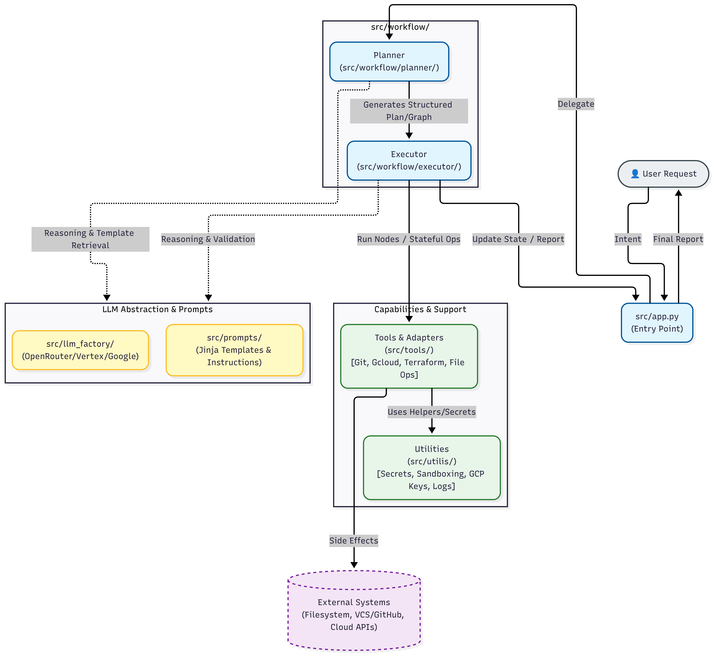

# DevOps-Agent

## Description
LLM-driven two-stage orchestration agent that converts high-level DevOps tasks into actions by combining a planner, an executor, and a set of tools.

This architecture is inspired from the [PLAN-AND-ACT: Improving Planning of Agents for Long-Horizon Tasks](https://arxiv.org/pdf/2503.09572).

## High-level behavior
- Planner → decomposes user intent into a structured plan (graph of nodes).
- Executor → runs planner nodes as stateful, auditable operations and invokes tool adapters to perform side effects.
- Tools → modular adapters for file operations, VCS, GCP, Terraform, PRs, logs and other capabilities.

<figure>
  
  <figcaption>Overview of the agent's architecture.</figcaption>
</figure>